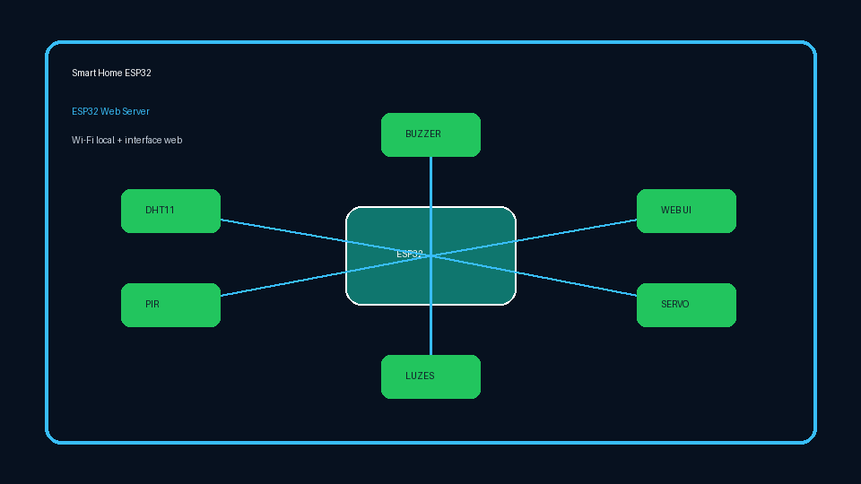
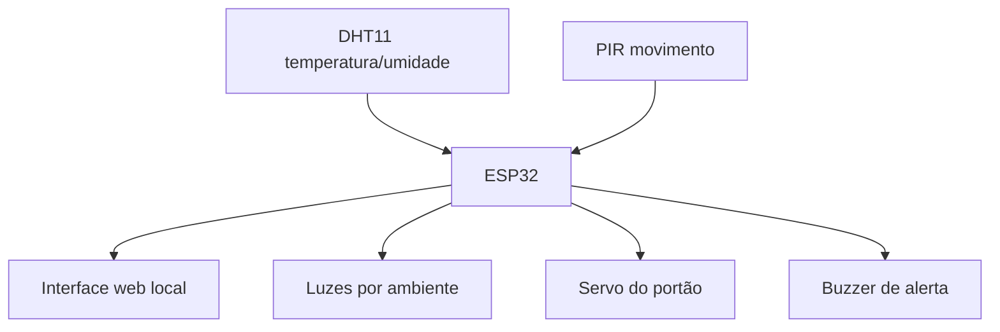

# Smart Home ESP32

Projeto de automação residencial com ESP32, sensores, atuadores e interface web local. A proposta é demonstrar controle de hardware, leitura de sensores e lógica não bloqueante em um sistema embarcado simples de entender e replicar.

## Demonstração



O GIF resume a arquitetura do projeto. A execução real depende do circuito físico com ESP32, DHT11, PIR, buzzer, servo e LEDs/relés.

## Funcionalidades

* Interface web servida diretamente pelo ESP32.
* Monitoramento de temperatura e umidade com DHT11.
* Detecção de movimento com sensor PIR.
* Controle de iluminação por ambientes.
* Controle de portão com servo motor.
* Buzzer para alertas e melodias.
* Lógica não bloqueante para manter sensores, interface e sons responsivos.

## Stack

| Área | Tecnologias |
| --- | --- |
| Hardware | ESP32, DHT11, PIR, servo, buzzer, LEDs/relés |
| Firmware | Arduino/C++ |
| Rede | Wi-Fi local, `WiFiServer` |
| Interface | HTML/CSS servido pelo microcontrolador |

## Arquitetura



## Pinagem principal

| Componente | GPIO |
| --- | ---: |
| DHT11 | 5 |
| PIR | 18 |
| Servo | 13 |
| Buzzer | 19 |
| LED/alarme | 2 |
| Sala | 4 |
| Varanda | 12 |
| Garagem | 14 |
| Cozinha | 15 |
| Quarto | 16 |
| Sótão | 17 |

## Como configurar

Copie o arquivo de exemplo:

```bash
cp secrets.example.h secrets.h
```

Edite `secrets.h` com a sua rede Wi-Fi local:

```cpp
const char* WIFI_SSID = "YOUR_WIFI_NAME";
const char* WIFI_PASSWORD = "YOUR_WIFI_PASSWORD";
```

`secrets.h` está no `.gitignore` e não deve ser versionado.

## Como executar

1. Abra `Smarthome.ino` na Arduino IDE ou em ambiente compatível.
2. Instale as bibliotecas:
   * `ESP32Servo`
   * `DHT sensor library`
3. Selecione a placa ESP32 correta.
4. Compile e envie o firmware.
5. Abra o Serial Monitor para ver o IP local.
6. Acesse o IP no navegador conectado à mesma rede.

## Como testar

* Validar se o ESP32 conecta ao Wi-Fi local.
* Confirmar leitura de temperatura e umidade.
* Acionar cada saída de luz pela interface.
* Acionar abertura/fechamento do servo.
* Simular movimento no PIR e observar alerta visual/sonoro.
* Confirmar que música/alerta não bloqueia atualização da interface.

## O que este projeto demonstra

* Programação embarcada com C++/Arduino.
* Organização de pinos e periféricos no ESP32.
* Interface web local sem backend externo.
* Separação segura de credenciais Wi-Fi.
* Lógica não bloqueante para melhorar responsividade em IoT.

## Próximos passos

* Adicionar fotos reais da maquete.
* Separar HTML/CSS em blocos mais fáceis de manter.
* Migrar para PlatformIO.
* Adicionar testes documentados por checklist.
* Criar versão com MQTT ou dashboard externo.
